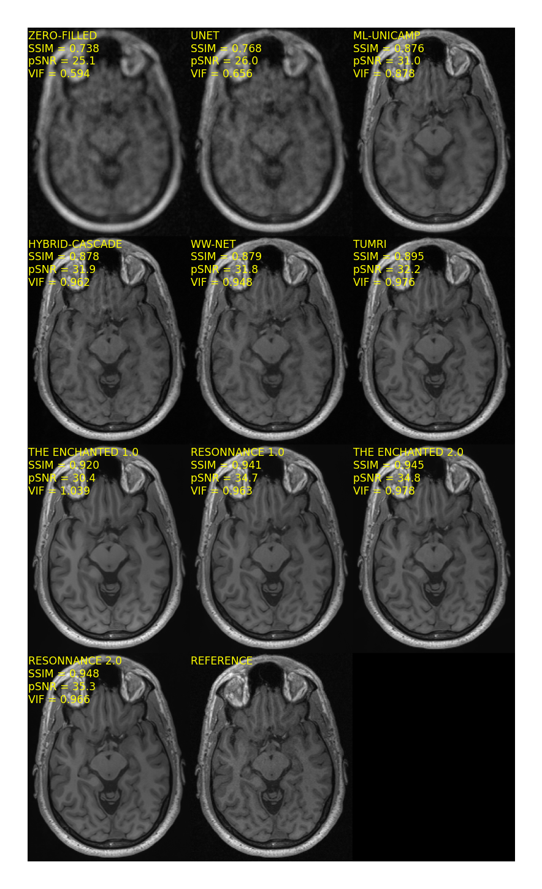
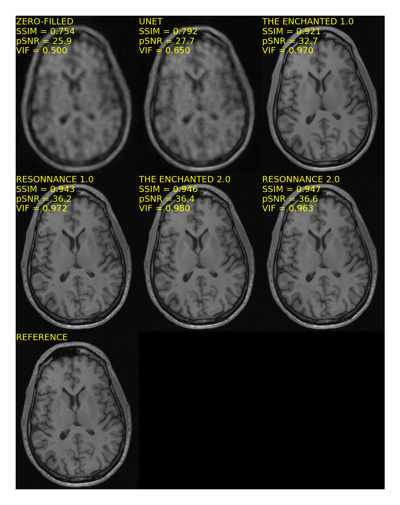

# Multi-Coil MRI (MC-MRI) Reconstruction  Challenge 

## 12-channel (source domain)

## 32-channel (target domain)

## Summary

Magnetic resonance (MR) is a sensitive diagnostic imaging modality that allows specific investigation of the
structure and function of the brain and body. One major drawback is the overall MR acquisition time, which can
easily exceed 30 minutes per subject. Lengthy MR acquisition times are costly (~$300 USD/per exam), increase
susceptibility to motion artifacts, which negatively impact image quality, reduce patient throughput and
contribute to patient discomfort. Parallel imaging (PI) and compressed sensing (CS) are two proven approaches
that allow to speed-up MR exams by collecting fewer k-space samples than stated by the Nyquist sampling
theorem. Deep learning methods are arguably the state-of-the-art for accelerated (i.e., from undersampled k-
space) MR reconstruction. Many works in the literature indicate that there is potential to make MR exams up to ten times faster
using sophisticated deep-learning-based reconstruction algorithms.To put that in perspective, in this challenge
we use 1 mm isotropic 3D T1-weighted brain MR acquisitions that took on average nearly six minutes to be acquired. 
Making it ten times faster would reduce the exam time to nearly 36 seconds and that is expected to have an enormous societal impact. 
 Deep learning reconstruction are divided in four groups: k-space-domain, image-domain, domain-transform, and hybrid k-space/image-domains
learning. At the moment, there is no clear winner among these proposed models. That happens in part due to the 
lack of benchmark datasets that allow fair comparisons. The [fastMRI](https://fastmri.org/) initiative is one good step
in that direction,. Our challenge is a complimentary initiative that provides
high-resolutuon 3D brain data. Working with 3D data allows you to undersample in both the phase-encoded and the slice-encoded directions (i.e. sparser data),
which potentially allows to further undersample k-space during acquisition.   Most works
so far investigated models that are specific to a coil with a given number of channels. Our challenge tackles this
issue. The goals of this challenge are:

   - Compare different deep-learning-based MR reconstruction models on a large dataset (> 200 GB);
   - Assess reconstruction models generalizability to a new dataset with a different number of channels compared to
the train and validation sets provided.

The challenge is composed of two separate tracks and teams are free to decide whether to submit to just one track
or both. We encourage teams to submit to both tracks. Each track will have a separate ranking.

   - Track 01: sampling pattern masks will be provided for R={5,10} (R is a commonly used symbol to represent the
acceleration factor) and submissions will be evaluated only on the 12-channel test data.
   - Track 02: sampling pattern masks will be provided for R={5,10}. Submissions will be evaluated both for the 12-channel
and 32-channel test data.

In these two tracks, we expect to be able to assess MR reconstruction quality, which tends to result in
reconstruction with noticeable loss in the high-frequency components, specially for such high acceleration rates.
Also by having two separate tracks, we expect to be able to quantify whether a more generic model capable of
reconstructing images acquired using coils with different number of channels will have a decreased performance
(if any) compared to a more specific model.

## Getting Started
* Create a new enviornment and install the requirements in `./requirements.txt`
* Execute `python setup.py develop` in this directory to add the project directory to your PYTHONPATH environment variable
* Download the data from the [MR Reconstruction Challenge](https://sites.google.com/view/calgary-campinas-dataset/mr-reconstruction-challenge) website.
* Extract data into the ./Data folder. Alternatively, extract the data at your preferred location and assign the `USER_SPECIFIED_DATA_PATH` variable in `./mrrec/constants.py` module to that directory. 
* Review JNotebooks for examples of how to use provided sample `DataGenerator` and baseline models. 
* Develop your own model for one

## Repository Structure

   - Data - Contains the sampling pattern masks for R = 5 and R = 10;
   - mrrec - Python modules to help load and process the data;
   - JNotebooks
      - getting-started: Scripts illustrating how to load, visualize, and apply undersampling masks to the data. It also illustrates a simple image generator. 
      - evaluation-system: Scripts for metrics computation and ranking of different submissions. Statistical analysis script will be **included soon**.
      - reference: Sample code illustrating how the test set references are computed. References are available only to the challenge organizers.
      - zero-filled-baseline: Zero-filled reconstruction baseline for the challenge. Files are saved in the same format as the challenge submission format.
      - unet-baseline (**pending**): U-net reconstruction baseline.		

## Questions?

More details about the challenge are available at the [challenge webpage](https://sites.google.com/view/calgary-campinas-dataset/mr-reconstruction-challenge) If you have any question or doubts, please contact Dr. Roberto Souza (roberto.medeirosdeso@ucalgary.ca). He should be able to answer them and potentially add them to the FAQ page in the website.

